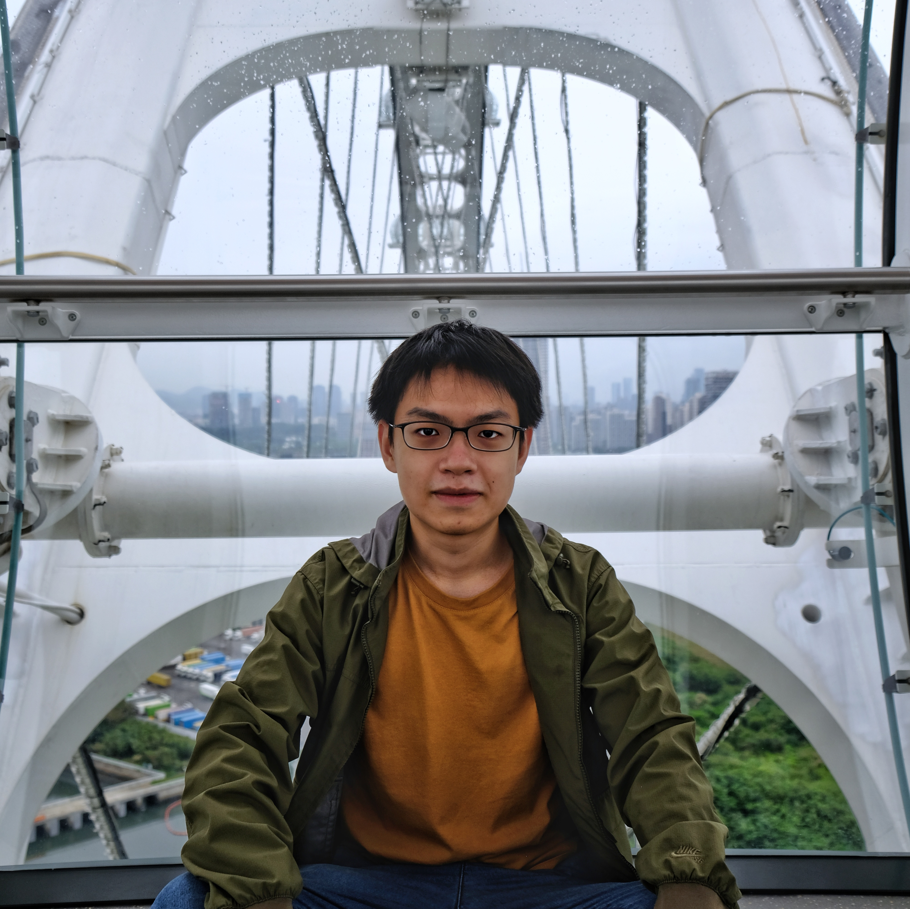

# About me

<!-- {width: 200px;} -->

I am a MPhil student at HKUST(GZ) supervised by [Prof. Mingming FAN](https://www.mingmingfan.com/). My research focuses on human-computer Interaction. Specifically, I am interested in accessibility, tangible interfaces, and social robots.

I obtained my Bachelor of Science degree in Integrative Systems and Design and in Computer Science at the Hong Kong University of Science and Technology in 2022. 

[**Download CV**](../assets/Yukai_ZHANG_CV.pdf)