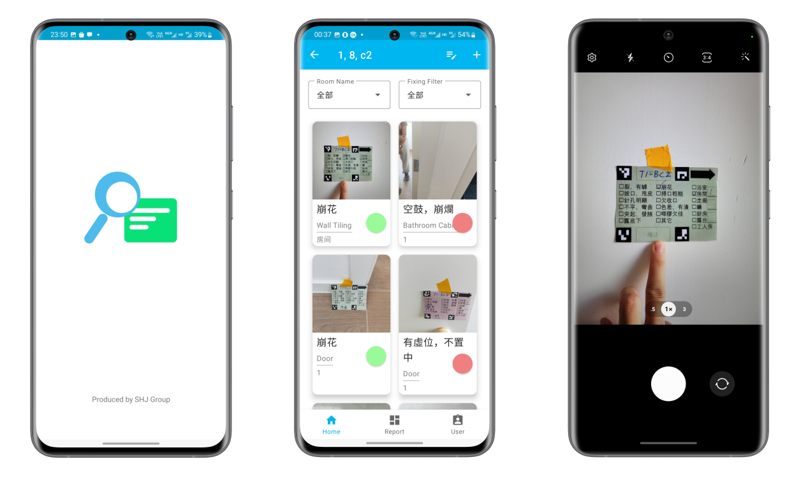
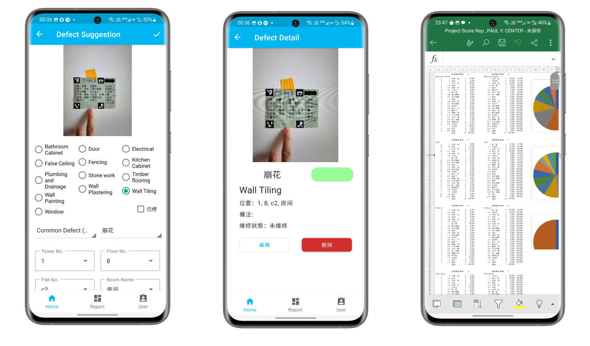
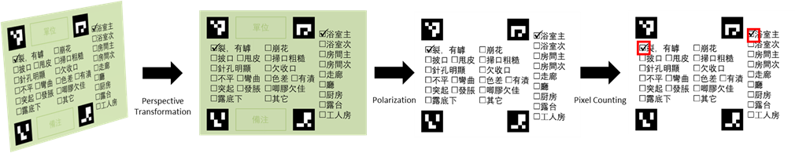

***Final year project at HKUST \\
Collaborated work with Sida CHEN, Jin TANG, and Tin Yuet LI***

<iframe src="https://drive.google.com/file/d/1JCsoWgzegMI3T6Dtlk-o8QZjPlNPBNYH/preview" width="560" height="315" allow="autoplay"></iframe>

In this project, we co-operated with Paul Y. Engineering to improve the efficiency of the inspection process. During the site visit, we noticed that the inspectors are still using traditional sticky notes to mark the defects and taking pictures of them for documentation, which is inefficient and error-prone. 

To solve this problem, we developed an Android application that allows inspectors to collect defect information efficiently with the assistance of computer vision algorithms and generate reports in based on collected information in a few seconds. On-site usability testing shows that the efficiency of the inspection procedure was significantly improved with the proposed system.

The APP organizes defects in projects, towers, and units. Inspectors can browse defects by selecting a unit and applying the various filters. Inspectors can take photos of a defect sticker to add a defect in the unit.

The APP automatically extracts information from the sticker and the image background. That information, after being confirmed by the inspector, will be documented in the APP along with the image. Based on this information, excel reports with detailed statistics about defects can be generated from each unit or project.

We improve the original stickers used by Paul Y. Engineering to make it easier for the APP to detect. An image classifier is used to automatically recognize the background (the defected object) the sticker is on. The network is trained using past inspection
records.

An on-site usability testing was carried out at a construction site in Tun-Mun to examine the performance improvement of the APP. The result shows that inspection workers can save more than 27% time on logging the defect data as first-time users.