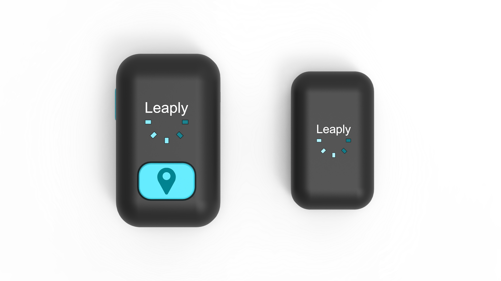
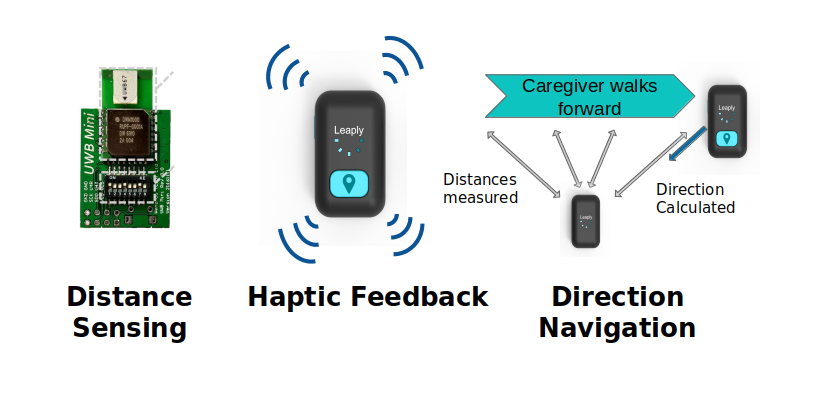
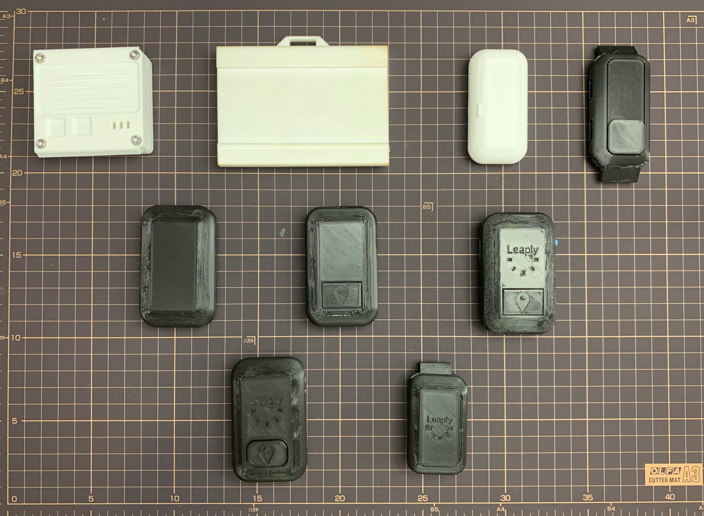
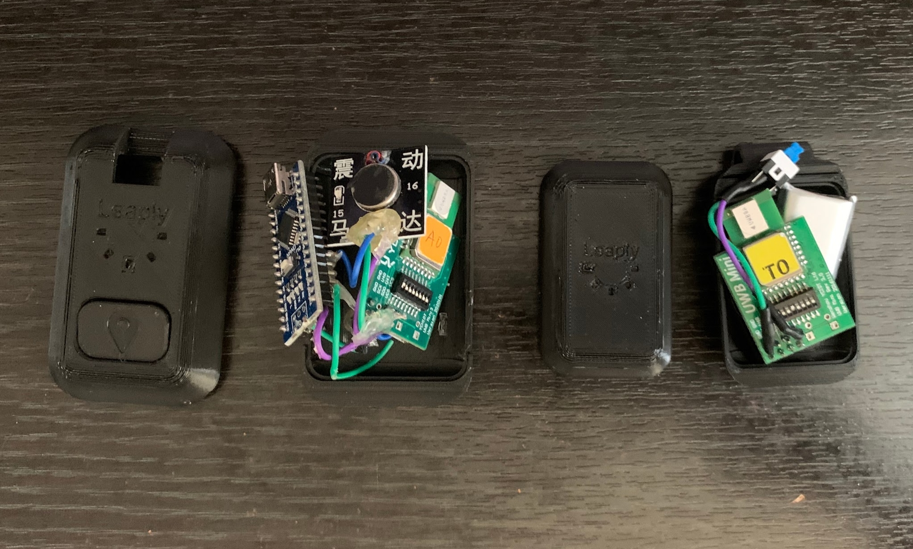

---
layout: post
title: 'Leaply - A Wandering Safety Device for Dementia Patients'
--- 

Leaply is a tracker designed to prevent dementia patients from getting lost. It tracks the distance between the dementia patient and caregiver, and alert the caregiver with haptic feedback before the patient get lost. 

The idea originates from our field research with a dementia patient and her husband in Hong Kong. We found through interviews and shadowing that one of main concern of taking care of a dementia patient is the risk of the patient getting lost during outdoor activities. 

