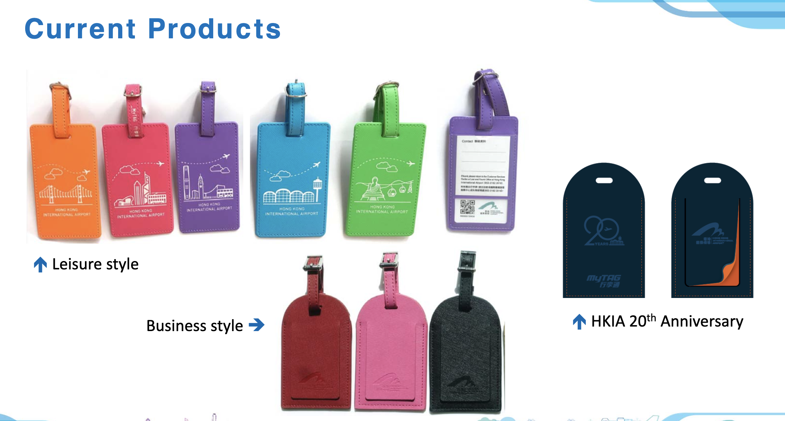
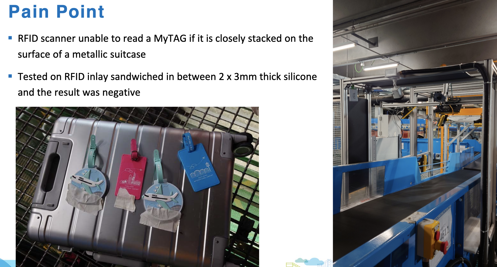
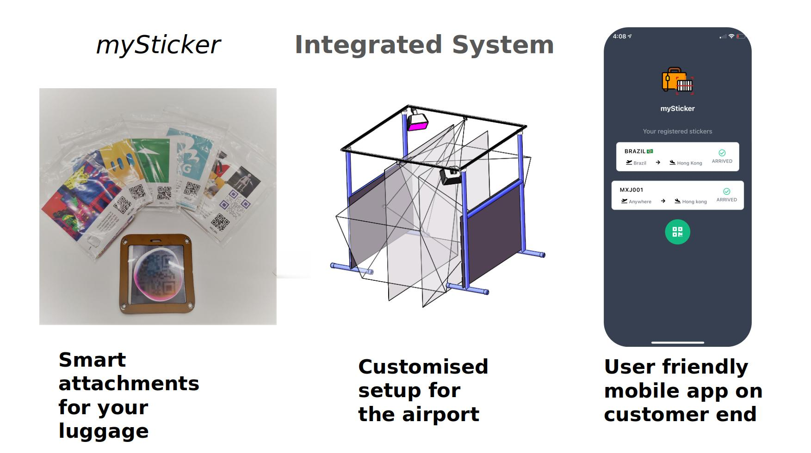
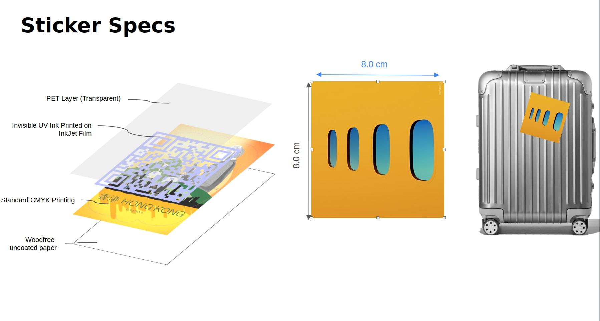
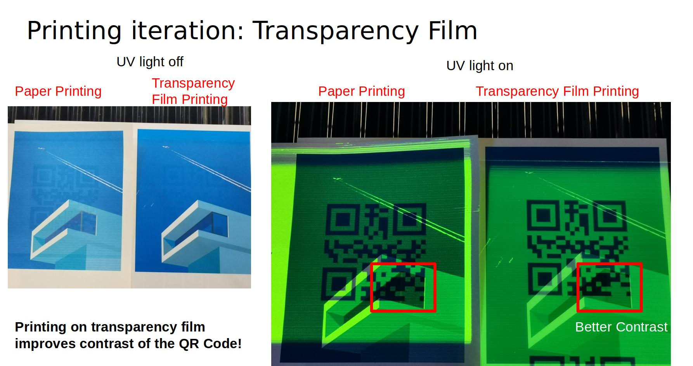
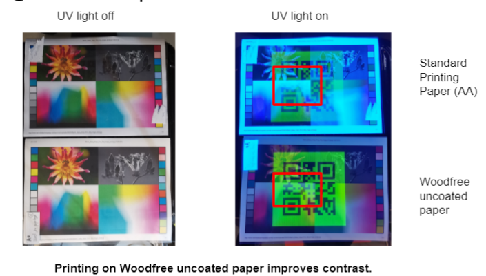

***Year project at HKUST \\
Collaborated work with Xuelai WEI and Mashiat LAMISA***

In this project, we collaborated with the Hong Kong International Airport (HKIA) to enhance their [MyTag system](https://www.hongkongairport.com/iwov-resources/html/MyTag/tc/mytagseries.html) - a luggage tag notifying passengers via an app when their luggage is delivered to the reclaim belt.
embedded in PVC or leather enclosures. The tag can read by RFID scanners installed at the arrival baggage belts after luggage is offloaded from flights and thereby notify the passengers.  

However, one problem raised by the Airport Authority is that the MyTag is cannot be read if it is closely stacked on the surface of a metallic suitcase.

**The System**\
Inspired by luggage stickers, the core idea of our project is to integrate the MyTag solution with stickers which many passengers use to customize their luggage. We designed and prototyped a luggage sticker with QR code invisible to human eyes and can only be detected at the luggage reclaim belt with UV light.

**The Sticker**\
We adopted a layered design to ensure the contrast of the QR code under UV lights. The invisible QR code is printed on a PET transparency film with fluorescent ink and the sticker image is printed on a Woodfree uncoated paper. 

Printing the code and the image on different layers prevent the inks from mixing up which improves the illumination and contrast of the QR code. 

**Video Demo**
<iframe width="560" height="315" src="https://www.youtube.com/embed/8wac1o2XNC8?si=3TxZa9UtxLypSBkS" title="YouTube video player" frameborder="0" allow="accelerometer; autoplay; clipboard-write; encrypted-media; gyroscope; picture-in-picture; web-share" allowfullscreen></iframe>

