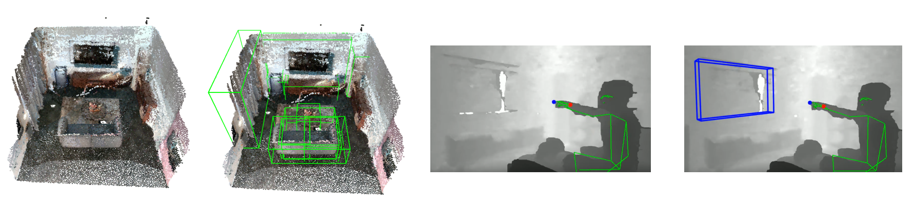

***Internship project at TCL AI Lab in Hong Kong***

<iframe width="560" height="315" src="https://www.youtube.com/embed/5Y0rsbU9_GA?si=sfrcY0We7JDen33G" title="YouTube video player" frameborder="0" allow="accelerometer; autoplay; clipboard-write; encrypted-media; gyroscope; picture-in-picture; web-share" allowfullscreen></iframe>

PIVOT is a multimodel control system for smart home appliances. The system allows users to specify a device with a pointing gesture before using a verbal command to control it, making the interaction more intuitive in rooms with multiple smart devices.  

Collaborated with UX designers at TCL, I created a proof-of-concept prototype for the system with an RGB-D camera and helped integrate it into future TCL TVs. 

The project won the [2022 IF Design Award](https://ifdesign.com/en/winner-ranking/project/pivot-smarthome-experience/348572). 