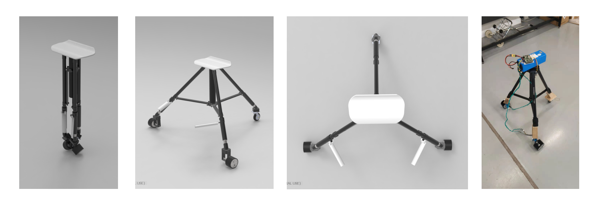
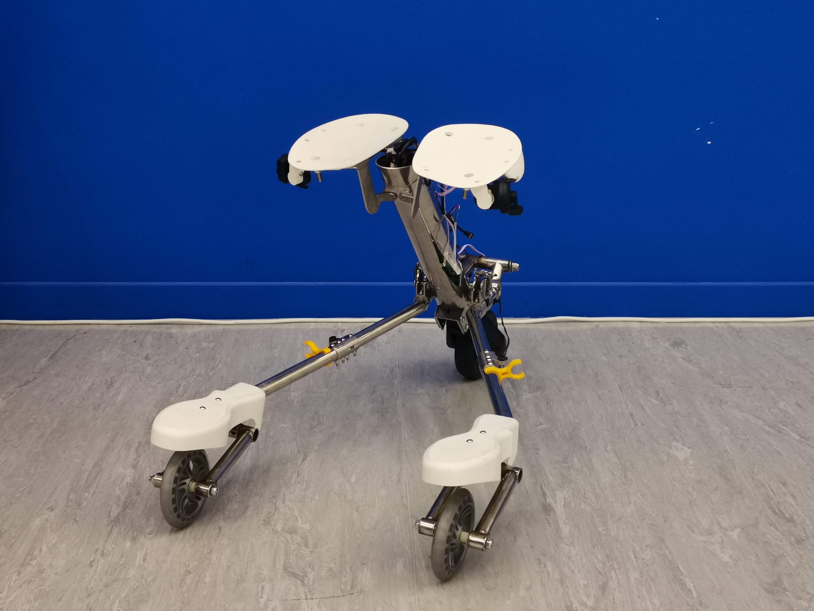

***3rd Year Project at ISD***\\
***Collaborated with Sida CHEN and Jiakun ZHENG***

The goal of the project is to design a personal mobility device that can be easily carried on public transportations. We designed and prototyped a three-wheel foldable electric bike inspired by tripods. 

**Initial Exploration**

**Design Iterations**

**Ergonomic Considerations**

**Folding Mechanism**

**Final Prototype**

